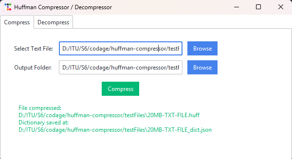
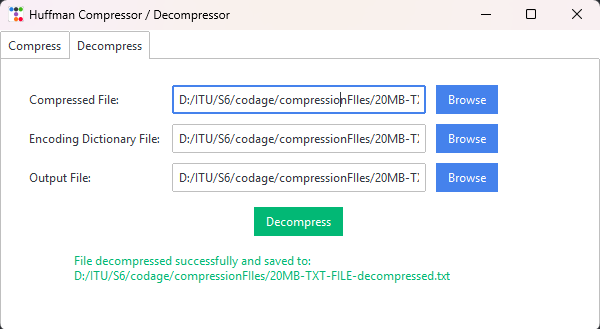
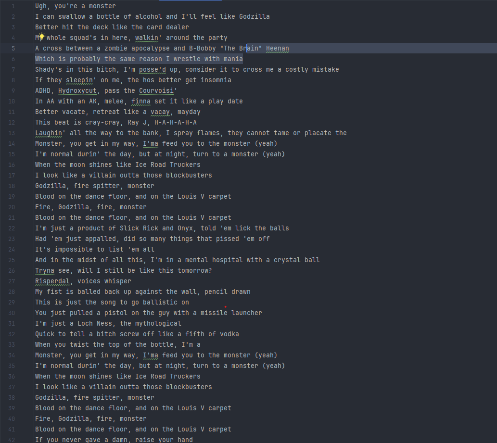
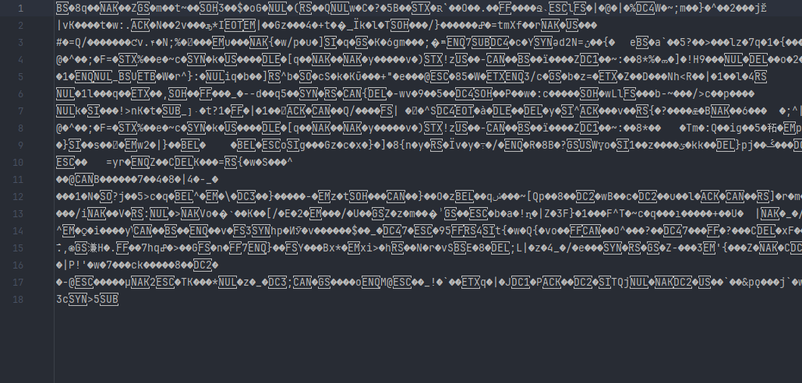

# Huffman Compressor / Decompressor

A modern, GUI-based Huffman encoder and decoder built using Python's Tkinter and ttkbootstrap libraries. This application allows users to compress text files into a binary format using Huffman encoding and then decompress them back to their original form. The application features two separate tabs for compression and decompression with an intuitive interface.

---

## Table of Contents

- [Overview](#overview)
- [Features](#features)
- [Screenshots](#screenshots)
- [Installation](#installation)
- [Usage](#usage)
- [Contact](#contact)

---

## Overview

The Huffman Compressor / Decompressor application is designed to efficiently encode text files using Huffman encoding. It produces two output files during compression:

1. **Compressed File:** A binary file containing the encoded text.
2. **Encoding Dictionary:** A JSON file that maps each letter to its corresponding binary code.

The decompression form uses these two files to accurately restore the original text file.

---

## Features

- **Graphical User Interface (GUI):** Built with Tkinter and enhanced by ttkbootstrap for a modern look.
- **Tabbed Layout:** Two tabs allow seamless switching between Compression and Decompression forms.
- **File Browsing:** Easily select input files and output destinations using file dialogs.
- **Huffman Encoding:** Compresses text by converting each character to a variable-length binary string.
- **Accurate Decompression:** Restores the original file using the saved encoding dictionary.
- **User-friendly Status Updates:** Displays success or error messages during compression and decompression.

---

## Screenshots

Here are some illustration pictures of the application:

### Compression Form



### Decompression Form



### Original Text File



### Compressed Output File



### Encoding Dictionary File


---

## Installation

### Prerequisites

- Python 3.x
- [ttkbootstrap](https://github.com/israel-dryer/ttkbootstrap)
- Standard Python libraries (`tkinter`, `json`, `os`)

### Setup

1. Clone the repository:

   ```bash
   git clone https://github.com/LegendaryGhost/huffman-compressor.git
   cd huffman-compressor
   ```

2. (Optional) Create and activate a virtual environment:

   ```bash
   python -m venv venv
   source venv/bin/activate  # On Windows use: venv\Scripts\activate
   ```

3. Install required packages:

   ```bash
   pip install ttkbootstrap
   ```

4. Ensure that the `huffman` module (containing the `Huffman` class and `Node` class) is available in your project structure.

---

## Usage

- Run the application by executing the main script:
    
    ```bash
    python huffman/CompressionApp.py
    ```

### Compression

1. Select a text file to compress.
2. Choose an output folder (or leave it to default).
3. Click **Compress**.
4. The application creates a compressed binary file (with `.huff` extension) and a JSON encoding dictionary.

### Decompression

1. Switch to the **Decompress** tab.
2. Select the compressed file.
3. Select the corresponding encoding dictionary file.
4. Choose an output file path for the decompressed text.
5. Click **Decompress**.
6. The application reconstructs the original text file.

---

## Contact

For any questions or suggestions, please contact:

- **Rihantiana MBOLATSIORY**  
  Email: rihantiana000@gmail.com  
  GitHub: [LegendaryGhost](https://github.com/LegendaryGhost)